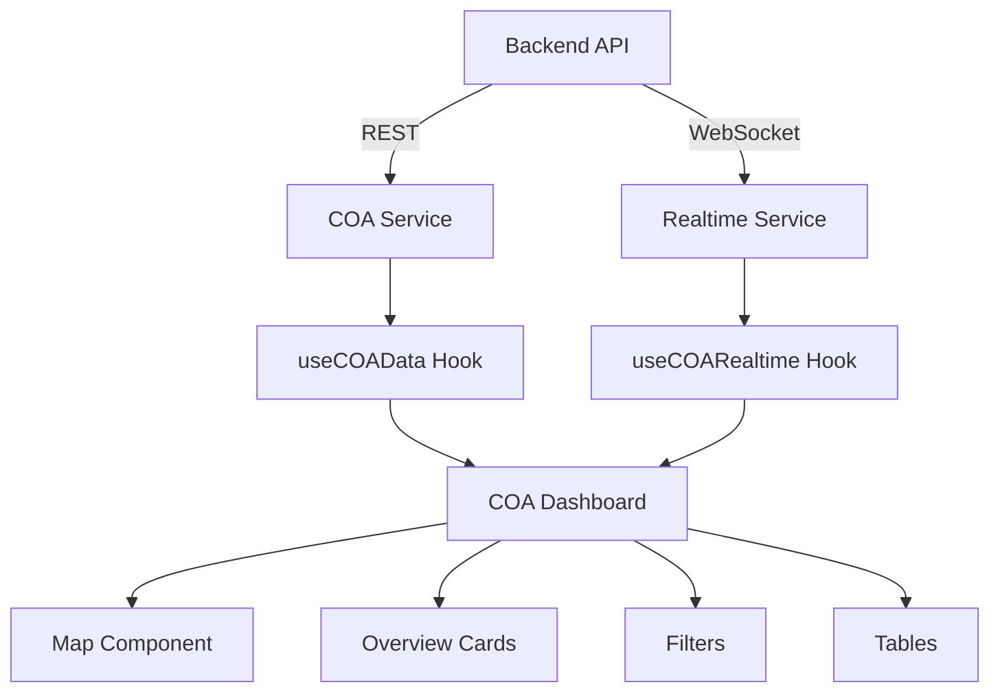

# 📊 PLANO DE IMPLEMENTAÇÃO - COA COM DADOS REAIS

## 📋 ÍNDICE
1. [Visão Geral](#visão-geral)
2. [Análise do Estado Atual](#análise-do-estado-atual)
3. [Arquitetura Proposta](#arquitetura-proposta)
4. [Componentes a Criar/Refatorar](#componentes-a-criarrefatorar)
5. [Serviços e Hooks](#serviços-e-hooks)
6. [Plano de Implementação Passo a Passo](#plano-de-implementação-passo-a-passo)
7. [Estrutura de Dados](#estrutura-de-dados)
8. [Considerações de Performance](#considerações-de-performance)
9. [Preparação para Permissões](#preparação-para-permissões)

---

## 📌 VISÃO GERAL

### Objetivo
Transformar a página COA (Centro de Operações Avançadas) de dados mockados para dados reais, mantendo:
- ✅ Alta performance
- ✅ Código componentizado e reutilizável
- ✅ Preparado para sistema de permissões
- ✅ Fácil manutenção e extensibilidade

### Stack Atual
- **Frontend**: React + TypeScript + Vite
- **Backend**: NestJS + PostgreSQL + Prisma
- **Mapas**: Leaflet
- **Estado**: Zustand (para alguns stores)
- **Requisições**: Axios

---

## 🔍 ANÁLISE DO ESTADO ATUAL

### ✅ O QUE JÁ EXISTE

#### Backend - Rotas Disponíveis

**Plantas Controller** (`/api/v1/plantas`)
```typescript
GET    /proprietarios         // Lista proprietários
POST   /                      // Criar planta
GET    /                      // Listar plantas com filtros
GET    /:id                   // Buscar planta específica
GET    /:plantaId/unidades    // Listar unidades da planta
PUT    /:id                   // Atualizar planta
DELETE /:id                   // Deletar planta
```

**Unidades Controller** (`/api/v1/unidades`)
```typescript
POST   /                           // Criar unidade
GET    /                           // Listar unidades com filtros
GET    /planta/:plantaId          // Unidades por planta
GET    /:id                       // Buscar unidade específica
GET    /:id/estatisticas          // Estatísticas da unidade
PUT    /:id                       // Atualizar unidade
DELETE /:id                       // Deletar unidade
GET    /:id/equipamentos          // Equipamentos da unidade
GET    /:id/equipamentos/estatisticas  // Estatísticas dos equipamentos
GET    /:id/diagramas             // Diagramas da unidade
```

**Equipamentos Controller** (`/api/v1/equipamentos`)
```typescript
POST   /                           // Criar equipamento
GET    /                           // Listar equipamentos
GET    /ucs-disponiveis           // UCs disponíveis
GET    /:id                       // Buscar equipamento
GET    /:id/componentes           // Componentes do equipamento
PATCH  /:id                       // Atualizar equipamento
DELETE /:id                       // Deletar equipamento
GET    /unidade/:unidadeId/equipamentos  // Equipamentos por unidade
GET    /unidades/:unidadeId/estatisticas // Estatísticas
GET    /:id/dados/atual           // Dados atuais
GET    /:id/dados/historico       // Histórico de dados
```

**Equipamentos Dados Controller** (`/api/v1/equipamentos-dados`)
```typescript
GET    /:id/latest               // Dados mais recentes
GET    /:id/history              // Histórico
GET    /:id/stats                // Estatísticas
GET    /:id/grafico-dia          // Dados do dia
GET    /:id/grafico-mes          // Dados do mês
GET    /:id/grafico-ano          // Dados do ano
GET    /:id/custos-energia       // Custos de energia
```

#### Frontend - Serviços Existentes

**Serviços Disponíveis** (`src/services/`)
- ✅ `plantas.services.ts` - CRUD completo de plantas
- ✅ `unidades.services.ts` - CRUD completo de unidades
- ✅ `equipamentos.services.ts` - CRUD completo de equipamentos
- ✅ `equipamentos-dados.service.ts` - Dados em tempo real
- ✅ `usuarios.services.ts` - Gestão de usuários
- ✅ `auth.service.ts` - Autenticação

### ❌ O QUE FALTA IMPLEMENTAR

1. **Rota de Dashboard Agregado** no backend
2. **Hook para dados do COA** no frontend
3. **Componentes refatorados** para usar dados reais
4. **Sistema de cache** para otimizar performance
5. **WebSocket/SSE** para atualizações em tempo real
6. **Tratamento de erros** robusto

---

## 🏗️ ARQUITETURA PROPOSTA

### Estrutura de Componentes

```
src/
├── features/
│   └── coa/
│       ├── components/
│       │   ├── COADashboard.tsx         # Componente principal
│       │   ├── COAMap/
│       │   │   ├── index.tsx            # Mapa interativo
│       │   │   ├── COAMapMarker.tsx     # Marcador customizado
│       │   │   ├── COAMapControls.tsx   # Controles do mapa
│       │   │   └── COAMapLegend.tsx     # Legenda
│       │   ├── COAOverviewCards/
│       │   │   ├── index.tsx            # Container dos cards
│       │   │   ├── EnergyCard.tsx       # Card de energia
│       │   │   ├── ConsumptionCard.tsx  # Card de consumo
│       │   │   ├── AccumulatedCard.tsx  # Card acumulado
│       │   │   └── StatusCard.tsx       # Card de status
│       │   ├── COAFilters/
│       │   │   ├── index.tsx            # Container de filtros
│       │   │   ├── ClientFilter.tsx     # Filtro de cliente
│       │   │   └── UnitFilter.tsx       # Filtro de unidade
│       │   ├── COATables/
│       │   │   ├── index.tsx            # Container das tabelas
│       │   │   ├── UFVTable.tsx         # Tabela de UFVs
│       │   │   └── LoadTable.tsx        # Tabela de cargas
│       │   └── COAAssetModal/
│       │       └── index.tsx            # Modal de detalhes
│       ├── hooks/
│       │   ├── useCOAData.ts            # Hook principal de dados
│       │   ├── useCOAFilters.ts         # Hook de filtros
│       │   ├── useCOAMap.ts             # Hook do mapa
│       │   └── useCOARealtime.ts        # Hook tempo real
│       ├── services/
│       │   ├── coaService.ts            # Serviço principal
│       │   └── coaWebSocket.ts          # WebSocket service
│       ├── types/
│       │   └── index.ts                 # Tipos TypeScript
│       └── utils/
│           ├── calculations.ts          # Cálculos
│           ├── formatters.ts            # Formatadores
│           └── mapHelpers.ts            # Helpers do mapa
```

### Fluxo de Dados



---

## 🔧 COMPONENTES A CRIAR/REFATORAR

### 1. COADashboard (Componente Principal)

```typescript
// src/features/coa/components/COADashboard.tsx
interface COADashboardProps {
  initialFilters?: COAFilters;
  onAssetClick?: (asset: Asset) => void;
}

export const COADashboard: React.FC<COADashboardProps> = ({
  initialFilters,
  onAssetClick
}) => {
  const { data, loading, error, refetch } = useCOAData();
  const { filters, updateFilters, resetFilters } = useCOAFilters(initialFilters);
  const { subscribe, unsubscribe } = useCOARealtime();

  useEffect(() => {
    const assetIds = data?.assets.map(a => a.id) || [];
    subscribe(assetIds);
    return () => unsubscribe(assetIds);
  }, [data?.assets]);

  // Implementação...
};
```

### 2. COAMap (Mapa Interativo)

```typescript
// src/features/coa/components/COAMap/index.tsx
interface COAMapProps {
  assets: Asset[];
  selectedAsset?: string;
  onAssetSelect: (assetId: string) => void;
  filters: COAFilters;
}

export const COAMap: React.FC<COAMapProps> = ({
  assets,
  selectedAsset,
  onAssetSelect,
  filters
}) => {
  const { mapRef, setFocus, resetView } = useCOAMap();

  // Implementação com Leaflet
};
```

### 3. COAOverviewCards (Cards de Métricas)

```typescript
// src/features/coa/components/COAOverviewCards/index.tsx
interface COAOverviewCardsProps {
  metrics: COAMetrics;
  loading?: boolean;
}

export const COAOverviewCards: React.FC<COAOverviewCardsProps> = ({
  metrics,
  loading
}) => {
  return (
    <div className="grid grid-cols-1 md:grid-cols-2 lg:grid-cols-4 gap-4">
      <EnergyCard value={metrics.totalEnergy} loading={loading} />
      <ConsumptionCard value={metrics.totalConsumption} loading={loading} />
      <AccumulatedCard value={metrics.accumulated} loading={loading} />
      <StatusCard statuses={metrics.statuses} loading={loading} />
    </div>
  );
};
```

---

## 🎣 SERVIÇOS E HOOKS

### 1. COA Service (Principal)

```typescript
// src/features/coa/services/coaService.ts
class COAService {
  async getDashboardData(filters?: COAFilters): Promise<COADashboardData> {
    // Fazer múltiplas chamadas em paralelo
    const [plantas, unidades, equipamentos, dados] = await Promise.all([
      PlantasService.findAll(filters),
      UnidadesService.findAll(filters),
      EquipamentosService.findAll(filters),
      EquipamentosDadosService.getLatestBatch(filters)
    ]);

    return this.aggregateData(plantas, unidades, equipamentos, dados);
  }

  private aggregateData(...) {
    // Lógica de agregação
  }

  async getMetrics(filters?: COAFilters): Promise<COAMetrics> {
    // Cálculo de métricas
  }
}

export const coaService = new COAService();
```

### 2. Hook Principal (useCOAData)

```typescript
// src/features/coa/hooks/useCOAData.ts
interface UseCOADataOptions {
  filters?: COAFilters;
  refreshInterval?: number;
  enabled?: boolean;
}

export function useCOAData(options: UseCOADataOptions = {}) {
  const [data, setData] = useState<COADashboardData | null>(null);
  const [loading, setLoading] = useState(true);
  const [error, setError] = useState<Error | null>(null);

  const fetchData = useCallback(async () => {
    try {
      setLoading(true);
      const result = await coaService.getDashboardData(options.filters);
      setData(result);
      setError(null);
    } catch (err) {
      setError(err as Error);
    } finally {
      setLoading(false);
    }
  }, [options.filters]);

  useEffect(() => {
    if (options.enabled !== false) {
      fetchData();
    }
  }, [fetchData, options.enabled]);

  // Auto-refresh
  useEffect(() => {
    if (options.refreshInterval && options.enabled !== false) {
      const interval = setInterval(fetchData, options.refreshInterval);
      return () => clearInterval(interval);
    }
  }, [fetchData, options.refreshInterval, options.enabled]);

  return { data, loading, error, refetch: fetchData };
}
```

### 3. Hook de Tempo Real

```typescript
// src/features/coa/hooks/useCOARealtime.ts
export function useCOARealtime() {
  const [socket, setSocket] = useState<WebSocket | null>(null);
  const [connected, setConnected] = useState(false);

  const connect = useCallback(() => {
    const ws = new WebSocket(import.meta.env.VITE_WS_URL);

    ws.onopen = () => {
      setConnected(true);
      console.log('COA WebSocket connected');
    };

    ws.onmessage = (event) => {
      const data = JSON.parse(event.data);
      handleRealtimeUpdate(data);
    };

    ws.onerror = (error) => {
      console.error('COA WebSocket error:', error);
    };

    ws.onclose = () => {
      setConnected(false);
      // Implementar reconnect logic
    };

    setSocket(ws);
  }, []);

  const subscribe = useCallback((assetIds: string[]) => {
    if (socket && connected) {
      socket.send(JSON.stringify({
        type: 'subscribe',
        assetIds
      }));
    }
  }, [socket, connected]);

  return { connect, subscribe, connected };
}
```

---

## 📝 PLANO DE IMPLEMENTAÇÃO PASSO A PASSO

### FASE 1: Backend - Criar Endpoint Agregado (2-3 horas)

#### 1.1. Criar COA Module
```bash
# Terminal
nest g module coa
nest g controller coa
nest g service coa
```

#### 1.2. Implementar COAController
```typescript
// src/modules/coa/coa.controller.ts
@Controller('coa')
export class COAController {
  @Get('dashboard')
  async getDashboardData(@Query() filters: COAFiltersDto) {
    return this.coaService.getDashboardData(filters);
  }

  @Get('metrics')
  async getMetrics(@Query() filters: COAFiltersDto) {
    return this.coaService.getMetrics(filters);
  }

  @Get('assets/realtime')
  async getRealtimeData(@Query('ids') ids: string[]) {
    return this.coaService.getRealtimeData(ids);
  }
}
```

#### 1.3. Implementar COAService
```typescript
// src/modules/coa/coa.service.ts
@Injectable()
export class COAService {
  async getDashboardData(filters: COAFiltersDto) {
    // Agregar dados de plantas, unidades e equipamentos
    const plantas = await this.prisma.plantas.findMany({
      where: this.buildWhereClause(filters),
      include: {
        unidades: {
          include: {
            equipamentos: true
          }
        }
      }
    });

    return this.transformToCoaFormat(plantas);
  }
}
```

### FASE 2: Frontend - Estrutura Base (2 horas)

#### 2.1. Criar estrutura de pastas
```bash
mkdir -p src/features/coa/{components,hooks,services,types,utils}
```

#### 2.2. Definir tipos TypeScript
```typescript
// src/features/coa/types/index.ts
export interface COAAsset {
  id: string;
  name: string;
  type: 'UFV' | 'CARGA' | 'TRANSFORMADOR';
  status: 'NORMAL' | 'ALARME' | 'TRIP' | 'URGENCIA';
  coordinates: {
    lat: number;
    lng: number;
  };
  power: {
    nominal: number;
    current: number;
  };
  efficiency: number;
  availability: number;
  lastUpdate: Date;
  plantId: string;
  unitId: string;
}

export interface COAMetrics {
  totalEnergy: number;
  totalConsumption: number;
  accumulated: number;
  statuses: {
    trips: number;
    alarms: number;
    urgencies: number;
    openOS: number;
  };
}

export interface COAFilters {
  clientId?: string;
  plantId?: string;
  unitId?: string;
  status?: string[];
  dateRange?: {
    start: Date;
    end: Date;
  };
}
```

### FASE 3: Implementar Serviços (3 horas)

#### 3.1. COA Service
```typescript
// src/features/coa/services/coaService.ts
import { api } from '@/config/api';

class COAService {
  private baseUrl = '/api/v1/coa';

  async getDashboardData(filters?: COAFilters): Promise<COADashboardData> {
    const response = await api.get(`${this.baseUrl}/dashboard`, {
      params: filters
    });
    return response.data;
  }

  async getMetrics(filters?: COAFilters): Promise<COAMetrics> {
    const response = await api.get(`${this.baseUrl}/metrics`, {
      params: filters
    });
    return response.data;
  }

  async getRealtimeData(assetIds: string[]): Promise<COARealtimeData> {
    const response = await api.get(`${this.baseUrl}/assets/realtime`, {
      params: { ids: assetIds }
    });
    return response.data;
  }
}

export const coaService = new COAService();
```

### FASE 4: Implementar Hooks (2 horas)

#### 4.1. Hook Principal
```typescript
// src/features/coa/hooks/useCOAData.ts
import { useQuery } from '@tanstack/react-query';
import { coaService } from '../services/coaService';

export function useCOAData(filters?: COAFilters) {
  return useQuery({
    queryKey: ['coa-dashboard', filters],
    queryFn: () => coaService.getDashboardData(filters),
    staleTime: 5000, // 5 segundos
    refetchInterval: 30000, // 30 segundos
  });
}
```

### FASE 5: Implementar Componentes (4 horas)

#### 5.1. Componente Principal
```typescript
// src/features/coa/components/COADashboard.tsx
export const COADashboard: React.FC = () => {
  const { data, isLoading, error } = useCOAData();
  const [filters, setFilters] = useState<COAFilters>({});
  const [selectedAsset, setSelectedAsset] = useState<string | null>(null);

  if (isLoading) return <COALoading />;
  if (error) return <COAError error={error} />;
  if (!data) return <COAEmpty />;

  return (
    <div className="coa-dashboard">
      <COAHeader />
      <COAFilters filters={filters} onChange={setFilters} />
      <COAOverviewCards metrics={data.metrics} />
      <div className="grid grid-cols-1 lg:grid-cols-2 gap-6">
        <COAMap
          assets={data.assets}
          selectedAsset={selectedAsset}
          onAssetSelect={setSelectedAsset}
        />
        <COATables assets={data.assets} />
      </div>
      {selectedAsset && (
        <COAAssetModal
          assetId={selectedAsset}
          onClose={() => setSelectedAsset(null)}
        />
      )}
    </div>
  );
};
```

### FASE 6: Integração e Testes (2 horas)

#### 6.1. Atualizar rota
```typescript
// src/AppRoutes.tsx
import { COADashboard } from '@/features/coa/components/COADashboard';

// Substituir o componente antigo
{
  path: '/dashboard',
  element: (
    <ProtectedRoute>
      <AppTemplate>
        <COADashboard />
      </AppTemplate>
    </ProtectedRoute>
  ),
}
```

#### 6.2. Testes básicos
```typescript
// src/features/coa/__tests__/COADashboard.test.tsx
describe('COADashboard', () => {
  it('should render loading state', () => {
    // ...
  });

  it('should render data correctly', () => {
    // ...
  });

  it('should handle filters', () => {
    // ...
  });
});
```

### FASE 7: Otimizações (2 horas)

#### 7.1. Implementar cache
```typescript
// src/features/coa/utils/cache.ts
class COACache {
  private cache = new Map<string, any>();
  private ttl = 60000; // 1 minuto

  set(key: string, value: any) {
    this.cache.set(key, {
      value,
      timestamp: Date.now()
    });
  }

  get(key: string) {
    const item = this.cache.get(key);
    if (!item) return null;

    if (Date.now() - item.timestamp > this.ttl) {
      this.cache.delete(key);
      return null;
    }

    return item.value;
  }
}
```

#### 7.2. Implementar lazy loading
```typescript
// src/features/coa/components/index.ts
import { lazy, Suspense } from 'react';

export const COADashboard = lazy(() => import('./COADashboard'));

export const COADashboardWithSuspense = () => (
  <Suspense fallback={<COALoading />}>
    <COADashboard />
  </Suspense>
);
```

---

## 📊 ESTRUTURA DE DADOS

### Resposta da API

```typescript
interface COADashboardResponse {
  assets: {
    id: string;
    name: string;
    type: AssetType;
    plant: {
      id: string;
      name: string;
      client: {
        id: string;
        name: string;
      };
    };
    unit: {
      id: string;
      name: string;
      coordinates: Coordinates;
    };
    equipment: {
      id: string;
      status: EquipmentStatus;
      power: PowerData;
      lastData: EquipmentData;
    };
  }[];

  metrics: {
    totalEnergy: number;
    totalConsumption: number;
    accumulated: number;
    statuses: StatusCounts;
  };

  performance: {
    hourly: PerformanceData[];
    daily: PerformanceData[];
    monthly: PerformanceData[];
  };
}
```

### Estado Local

```typescript
interface COAState {
  // Dados
  assets: COAAsset[];
  metrics: COAMetrics;

  // Filtros
  filters: COAFilters;

  // UI
  selectedAsset: string | null;
  mapFocus: MapFocus | null;
  modalOpen: boolean;

  // Loading states
  loading: {
    dashboard: boolean;
    metrics: boolean;
    realtime: boolean;
  };

  // Errors
  errors: {
    dashboard?: Error;
    metrics?: Error;
    realtime?: Error;
  };
}
```

---

## ⚡ CONSIDERAÇÕES DE PERFORMANCE

### 1. Otimizações de Rede

```typescript
// Batching de requisições
const batchRequests = async (ids: string[]) => {
  const chunks = chunk(ids, 50); // Dividir em chunks de 50
  const results = await Promise.all(
    chunks.map(chunk => fetchBatch(chunk))
  );
  return results.flat();
};

// Debounce em filtros
const debouncedFilter = useMemo(
  () => debounce(handleFilterChange, 300),
  []
);
```

### 2. Otimizações de Renderização

```typescript
// Memoização de componentes pesados
const MemoizedMap = React.memo(COAMap, (prevProps, nextProps) => {
  return (
    prevProps.assets.length === nextProps.assets.length &&
    prevProps.selectedAsset === nextProps.selectedAsset
  );
});

// Virtual scrolling para tabelas grandes
import { VariableSizeList } from 'react-window';

const VirtualTable = ({ items }) => (
  <VariableSizeList
    height={600}
    itemCount={items.length}
    itemSize={() => 50}
    width="100%"
  >
    {Row}
  </VariableSizeList>
);
```

### 3. Cache Strategy

```typescript
// React Query com cache agressivo
const queryClient = new QueryClient({
  defaultOptions: {
    queries: {
      staleTime: 5 * 60 * 1000, // 5 minutos
      cacheTime: 10 * 60 * 1000, // 10 minutos
      refetchOnWindowFocus: false,
      refetchOnReconnect: 'always',
    },
  },
});

// IndexedDB para dados grandes
import { openDB } from 'idb';

const db = await openDB('coa-cache', 1, {
  upgrade(db) {
    db.createObjectStore('assets');
    db.createObjectStore('metrics');
  },
});
```

---

## 🔐 PREPARAÇÃO PARA PERMISSÕES

### 1. Estrutura de Permissões

```typescript
interface COAPermissions {
  // Visualização
  canViewAllClients: boolean;
  canViewOwnClients: boolean;
  allowedClients: string[];

  // Ações
  canExportData: boolean;
  canAccessRealtime: boolean;
  canViewFinancialData: boolean;

  // Filtros automáticos
  autoFilters: {
    clientIds?: string[];
    plantIds?: string[];
    unitIds?: string[];
  };
}
```

### 2. Hook de Permissões

```typescript
// src/features/coa/hooks/useCOAPermissions.ts
export function useCOAPermissions() {
  const { user } = useAuth();

  const permissions = useMemo(() => {
    // Lógica de permissões baseada no usuário
    const isAdmin = user?.roles?.includes('admin');
    const isManager = user?.roles?.includes('manager');

    return {
      canViewAllClients: isAdmin,
      canViewOwnClients: isManager || isAdmin,
      allowedClients: user?.allowedClients || [],
      canExportData: isAdmin || isManager,
      canAccessRealtime: true, // Por enquanto todos podem
      canViewFinancialData: isAdmin,
      autoFilters: {
        clientIds: !isAdmin ? user?.allowedClients : undefined,
      },
    };
  }, [user]);

  return permissions;
}
```

### 3. Aplicar Permissões nos Componentes

```typescript
// src/features/coa/components/COADashboard.tsx
export const COADashboard: React.FC = () => {
  const permissions = useCOAPermissions();

  // Aplicar filtros automáticos baseados em permissões
  const baseFilters = useMemo(() => ({
    ...permissions.autoFilters,
  }), [permissions]);

  const { data, isLoading } = useCOAData(baseFilters);

  // Condicionar renderização baseada em permissões
  return (
    <div>
      {permissions.canExportData && (
        <ExportButton data={data} />
      )}

      {permissions.canViewFinancialData && (
        <FinancialMetrics data={data} />
      )}

      <COAFilters
        filters={filters}
        onChange={setFilters}
        restrictedClients={!permissions.canViewAllClients}
        allowedClients={permissions.allowedClients}
      />
    </div>
  );
};
```

---

## 🚀 CRONOGRAMA DE IMPLEMENTAÇÃO

| Fase | Descrição | Tempo Estimado | Prioridade |
|------|-----------|----------------|------------|
| 1 | Backend - Endpoint agregado | 3 horas | Alta |
| 2 | Frontend - Estrutura base | 2 horas | Alta |
| 3 | Serviços e API client | 3 horas | Alta |
| 4 | Hooks customizados | 2 horas | Alta |
| 5 | Componentes principais | 4 horas | Alta |
| 6 | Integração e testes | 2 horas | Alta |
| 7 | Otimizações de performance | 2 horas | Média |
| 8 | WebSocket/Tempo real | 3 horas | Média |
| 9 | Sistema de permissões | 3 horas | Baixa |
| 10 | Documentação | 2 horas | Baixa |

**Total estimado: 26 horas**

---

## 📚 PRÓXIMOS PASSOS

1. **Começar pela Fase 1** - Criar o endpoint agregado no backend
2. **Validar com dados reais** - Testar com alguns registros primeiro
3. **Implementar incrementalmente** - Não fazer tudo de uma vez
4. **Manter compatibilidade** - Não quebrar funcionalidades existentes
5. **Documentar mudanças** - Atualizar este documento conforme necessário

---

## 🎯 CHECKLIST DE IMPLEMENTAÇÃO

- [ ] Backend endpoint `/api/v1/coa/dashboard`
- [ ] Backend endpoint `/api/v1/coa/metrics`
- [ ] Tipos TypeScript definidos
- [ ] COAService implementado
- [ ] useCOAData hook criado
- [ ] COADashboard refatorado
- [ ] COAMap usando dados reais
- [ ] COAOverviewCards com métricas reais
- [ ] COAFilters funcionando
- [ ] COATables com dados reais
- [ ] Cache implementado
- [ ] Testes básicos escritos
- [ ] Performance otimizada
- [ ] Preparado para permissões
- [ ] Documentação atualizada

---

## 📞 CONTATOS E REFERÊNCIAS

- **Documentação NestJS**: https://docs.nestjs.com/
- **React Query**: https://tanstack.com/query/latest
- **Leaflet**: https://leafletjs.com/
- **PostgreSQL**: https://www.postgresql.org/docs/

---

**Documento criado em**: 01/12/2024
**Última atualização**: 01/12/2024
**Versão**: 1.0.0